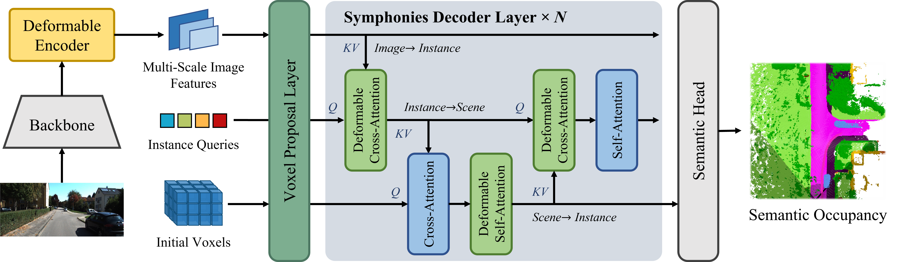

# Symphonies (Scene-from-Insts) 🎻


### **[Symphonize 3D Semantic Scene Completion with Contextual Instance Queries](https://arxiv.org/abs/2306.15670)**

[Haoyi Jiang](https://github.com/npurson)<sup>1,✢</sup>,
[Tianheng Cheng](https://scholar.google.com/citations?user=PH8rJHYAAAAJ)<sup>1,✢</sup>,
Naiyu Gao<sup>2</sup>,
Haoyang Zhang<sup>2</sup>,
[Wenyu Liu](http://eic.hust.edu.cn/professor/liuwenyu/)<sup>1</sup>,
[Xinggang Wang](https://xwcv.github.io/)<sup>1,✉️</sup>
<br>
<sup>1</sup>[School of EIC, HUST](http://english.eic.hust.edu.cn/),
<sup>2</sup>[Horizon Robotics](https://en.horizonrobotics.com/)

[](https://arxiv.org/abs/2306.15670)
[](LICENSE)

[](https://paperswithcode.com/sota/3d-semantic-scene-completion-from-a-single-1?p=symphonize-3d-semantic-scene-completion-with)

[](https://paperswithcode.com/sota/3d-semantic-scene-completion-from-a-single-2?p=symphonize-3d-semantic-scene-completion-with)

**TL;DR:** Our paper delve into enhancing SSC through the utilization of instance-centric representations. We propose a novel paradigm that integrates ***instance queries*** to facilitate ***instance semantics*** and capture ***global context***. Our approach achieves SOTA results of ***13.02 mIoU & 41.07 IoU*** on the SemanticKITTI *test* benchmark.

This project is built upon ***[TmPL](https://github.com/npurson/tmpl)***, a template for rapid & flexible DL experimentation development built upon [Lightning](https://lightning.ai/) & [Hydra](https://hydra.cc/).




## News

* ***Jun 28***: We have released the [arXiv paper](https://arxiv.org/abs/2306.15670) of Symphonies.
* ***Sep 18***: We have achieved state-of-the-art results on the recently published SSCBench-KITTI-360 benchmark.

## Preliminary

### Installation

1. Install PyTorch and Torchvision referring to https://pytorch.org/get-started/locally/.
2. Install MMDetection referring to https://mmdetection.readthedocs.io/en/latest/get_started.html#installation.
3. Install the rest of the requirements with pip.

    ```bash
    pip install -r requirements.txt
    ```

### Prepare Dataset

1. Download the RGB images, calibration files, and preprocess the labels, referring to the documentation of [VoxFormer](https://github.com/NVlabs/VoxFormer/blob/main/docs/prepare_dataset.md) or [MonoScene](https://github.com/astra-vision/MonoScene#semantickitti).

2. Generate depth predications with pre-trained MobileStereoNet referring to VoxFormer https://github.com/NVlabs/VoxFormer/tree/main/preprocess#3-image-to-depth.

## Usage

0. **Setup**

    ```shell
    export PYTHONPATH=`pwd`:$PYTHONPATH
    ```

1. **Training**

    ```shell
    python tools/train.py [--config-name config[.yaml]] [trainer.devices=4] \
        [+data_root=$DATA_ROOT] [+label_root=$LABEL_ROOT] [+depth_root=$DEPTH_ROOT]
    ```

    * Override the default config file with `--config-name`.
    * You can also override any value in the loaded config from the command line, refer to the following for more infomation.
        * https://hydra.cc/docs/tutorials/basic/your_first_app/config_file/
        * https://hydra.cc/docs/advanced/hydra-command-line-flags/
        * https://hydra.cc/docs/advanced/override_grammar/basic/

2. **Testing**

    ```shell
    python tools/test.py [+ckpt_path=...]
    ```

3. **Visualization**

    1. Generating outputs

        ```shell
        python tools/generate_outputs.py [+ckpt_path=...]
        ```

    2. Visualization

        ```shell
        python tools/generate_outputs.py [+output_file=...]
        ```

## Results

1. **SemanticKITTI**

    |                    Method                    | Split |  IoU  | mIoU  |         Download         |
    | :------------------------------------------: | :---: | :---: | :---: | :----------------------: |
    | [Symphonies](symphonies/configs/config.yaml) | test  | 41.07 | 13.02 | [model](<https://github.com/hustvl/Symphonies/releases/download/v1.0/e28_miou0.1344_remapped.ckpt>) |
    | [Symphonies](symphonies/configs/config.yaml) | val   | 41.44 | 13.44 | [log](<https://github.com/hustvl/Symphonies/releases/download/v1.0/log>) |

2. **KITTI-360**

    |                    Method                    | Split |  IoU  | mIoU  |         Download         |
    | :------------------------------------------: | :---: | :---: | :---: | :----------------------: |
    | [Symphonies](symphonies/configs/config.yaml) | test  | 43.11 | 16.22 | available soon           |

## Citation

If you find our paper and code useful for your research, please consider giving this repo a star :star: or citing :pencil::

```BibTeX
@article{jiang2023symphonies,
      title={Symphonize 3D Semantic Scene Completion with Contextual Instance Queries},
      author={Haoyi Jiang and Tianheng Cheng and Naiyu Gao and Haoyang Zhang and Wenyu Liu and Xinggang Wang},
      journal={arXiv preprint arXiv:2306.15670},
      year={2023}
}
```

## Acknowledgements

The development of this project is inspired and informed by [MonoScene](https://github.com/astra-vision/MonoScene), [MaskDINO](https://github.com/IDEA-Research/MaskDINO) and [VoxFormer](https://github.com/NVlabs/VoxFormer). We are thankful to build upon the pioneering work of these projects.

## License

Released under the [MIT](LICENSE) License.
