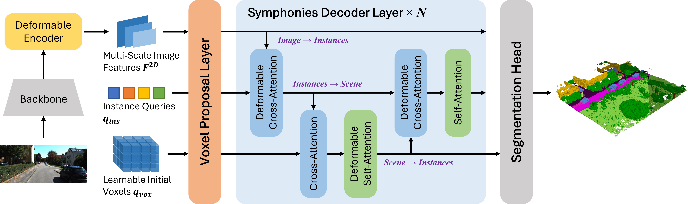

# Symphonies (Scene-from-Insts) 🎻


### **[Symphonize 3D Semantic Scene Completion with Contextual Instance Queries](TODO)**

[Haoyi Jiang](https://github.com/npurson)<sup>1,✢</sup>,
[Tianheng Cheng](https://scholar.google.com/citations?user=PH8rJHYAAAAJ)<sup>1,✢</sup>,
Naiyu Gao<sup>2</sup>,
Haoyang Zhang<sup>2</sup>,
[Wenyu Liu](http://eic.hust.edu.cn/professor/liuwenyu/)<sup>1</sup>,
[Xinggang Wang](https://xwcv.github.io/)<sup>1,✉️</sup>
<br>
<sup>1</sup>[School of EIC, HUST](http://english.eic.hust.edu.cn/),
<sup>2</sup>[Horizon Robotics](https://en.horizonrobotics.com/)

[](https://arxiv.org/abs/xxxxx)
[](https://opensource.org/licenses/MIT)




**TL;DR:** We delve into a novel query-based paradigm for SSC that incorporates ***instance queries*** to facilitate the ***instance-level semantics*** and ***global context***. Our approach achieves a SOTA of ***13.44 mIoU & 41.44 IoU*** on the SemanticKITTI *val* benchmark.

This project is built upon ***[TmPL](https://github.com/npurson/tmpl)***, a template for rapid & flexible DL development with [Lightning](https://lightning.ai/) & [Hydra](https://hydra.cc/).

## Installation

1. Install PyTorch and Torchvision referring to https://pytorch.org/get-started/locally/.
2. Install MMDetection referring to https://mmdetection.readthedocs.io/en/latest/get_started.html#installation.
3. Install the rest of the requirements with pip.

    ```bash
    pip install -r requirements.txt
    ```

## Usage

1. **Training**

    ```shell
    python tools/train.py [--config-name config[.yaml]] [trainer.devices=4] \
        [+data_root=$DATA_ROOT] [+label_root=$LABEL_ROOT] [+depth_root=$DEPTH_ROOT]
    ```

    * Override the default config file with `--config-name`.
    * You can also override any value in the loaded config from the command line, refer to the following for more infomation.
        * https://hydra.cc/docs/tutorials/basic/your_first_app/config_file/
        * https://hydra.cc/docs/advanced/hydra-command-line-flags/
        * https://hydra.cc/docs/advanced/override_grammar/basic/

2. **Generating outputs**

    ```shell
    python tools/generate_outputs.py [--config-name config[.yaml]] [+model.ckpt_path=/path/to/ckpt]
    ```

## Results

1. **SemanticKITTI *val***

    |                    Method                    |  IoU  | mIoU  |         Download         |
    | :------------------------------------------: | :---: | :---: | :----------------------: |
    | [Symphonies](symphonies/configs/config.yaml) | 41.44 | 13.44 | [model](<>) \| [log](<>) |

2. **SemanticKITTI *test***

    |                    Method                    |  IoU  | mIoU  |
    | :------------------------------------------: | :---: | :---: |
    | [Symphonies](symphonies/configs/config.yaml) | TODO  | TODO  |

## Citation


If you find our paper and code useful for your research, please consider giving a star :star:   and citation :pencil: :

```BibTeX
@article{
      title={Symphonize 3D Semantic Scene Completion with Contextual Instance Queries}, 
      author={Haoyi Jiang and Tianheng Cheng and Naiyu Gao and Haoyang Zhang and Wenyu Liu and Xinggang Wang},
      journal={arXiv preprint arXiv:2306.xxxxx},
      year={2023}
}
```


## License

Released under the [MIT](LICENSE) License.
